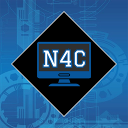

# NCC Computer Club Website 

Hello and welcome to the **Northampton Community College Computer Club website repository**! This repository is the perfect training ground for students of *computer science*, *web development and design*, *infosec*, *CIS*, *networking systems technology*, *application development*, and *systems administration* who want to build something real for themselves and the community.

## Our Mission

We, the students of Northampton Community College's computer and information technology sector, learn many skills through our studies, but we sometimes struggle to find practical applications for those skills outside the classroom. Our goal is to create a website that highlights the accomplishments of our organization, connects students, and promotes our members to potential employers and other external organizations, while also providing an ongoing project for future members.

### Year-to-Year Goal

Members of the Computer Club should work to keep this website updated each year with club news, potential projects, competition opportunities, and more. Most importantly, members must ensure that the website remains compatible with SEO standards and browser updates, as well as maintain the domain and servers that host the website.

### Learning Objective

The NCC Computer Club website repository is run entirely by members of the club, with various tasks requiring substantially different skill sets. This means that the full cooperation of the club's members is vital to its maintenance. Though the specifics of each student's chosen field of study will differ—and even students in the same field will have their own specialties—we hope that our members learn from each other and diversify their skill sets.

## About This Repository

All work done for the website will be committed to this repository. Anyone added here will be able to fork the repository, make commits, and create pull requests (PRs).

### Contribution

Members who would like to contribute to the repository must be directly added by the NCC Computer Club website project lead. Please provide the lead with your GitHub username and a brief explanation of how you would like to contribute to the website so you can be added to the repository.

To maintain an orderly project workflow, a few standards will be put in place for commits and pull requests. Please review the [contribution guide](./contribution-guide.md) as well as the [developer guide](./developer-guide.md).

### Tabs

GitHub repositories provide various tabs that make collaboration easier for contributors. Please use them accordingly:

#### Issues

We will use the Issues tab to propose new features, assign tasks, and report bugs. Individual members or teams may be assigned to each issue. Once an issue is claimed, no other member may contribute to it until it is either resolved or unassigned and reopened. Only administrators may open issues and assign them to members.

#### Discussions

The Discussions tab can be used by any member who has access to the repository. This is the place for general questions, concerns, and ideas. Please ensure that all discussions remain relevant and on-topic.

Within the Discussions menu, there is a section for *Announcements*. Be on the lookout for administrative announcements, which include regular updates and important information. There is also a *Task Board* for assigning general to-dos to project teams, individuals, or the club as a whole.